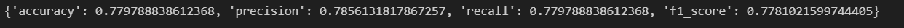

# BLENDED_LEARNING
# Implementation of Logistic Regression Model for Classifying Food Choices for Diabetic Patients

## AIM:
To implement a logistic regression model to classify food items for diabetic patients based on nutrition information.

## Equipments Required:
1. Hardware – PCs
2. Anaconda – Python 3.7 Installation / Jupyter notebook

## Algorithm
1. Import necessary libraries.
2. Load the dataset using pd.read_csv().
3. Display data types, basic statistics, and class distributions.
4. Visualize class distributions with a bar plot.
5. Scale feature columns using MinMaxScaler.
6. Encode target labels with LabelEncoder.
7. Split data into training and testing sets with train_test_split().
8. Train LogisticRegression with specified hyperparameters and evaluate the model using metrics and a confusion matrix plot. 

## Program:


Program to implement Logistic Regression for classifying food choices based on nutritional information.
Developed by: TARUNIKA D
RegisterNumber:  212223040227

```py
import pandas as pd
import numpy as np
from sklearn.preprocessing import OneHotEncoder, LabelEncoder, MinMaxScaler
from sklearn.model_selection import train_test_split, learning_curve
from sklearn.linear_model import LogisticRegression
from sklearn import metrics
from sklearn.metrics import classification_report, accuracy_score, confusion_matrix,ConfusionMatrixDisplay, precision_recall_fscore_support, precision_score, recall_score
import matplotlib.pyplot as plt
import seaborn as sns

dataset_url = "https://cf-courses-data.s3.us.cloud-object-storage.appdomain.cloud/IBM-ML241EN-SkillsNetwork/labs/datasets/food_items.csv"
food_df = pd.read_csv(dataset_url)

food_df.dtypes
```


```py
X_raw = food_df.iloc[:, :-1]
y_raw = food_df.iloc[:, -1:]
scaler = MinMaxScaler()
X = scaler.fit_transform(X_raw)
print(f"The range of feature inputs are within {X.min()} to {X.max()}")
```


```py
label_encoder = LabelEncoder()
y = label_encoder.fit_transform(y_raw.values.ravel())
np.unique(y, return_counts=True)
X_train, X_test, y_train, y_test = train_test_split(X, y, test_size=0.2, stratify=y, random_state = 2)
print(f"Training dataset shape, X_train: {X_train.shape}, y_train: {y_train.shape}")
print(f"Testing dataset shape, X_test: {X_test.shape}, y_test: {y_test.shape}")
```


```py
penalty= 'elasticnet'
multi_class = 'multinomial'
solver = 'saga'
max_iter = 1000
l1_ratio = 0.5
en_model = LogisticRegression(random_state=2, penalty=penalty, multi_class=multi_class, solver=solver, max_iter=max_iter, l1_ratio=l1_ratio)
en_model.fit(X_train, y_train)
```


```py
def evaluate_metrics(y_true, y_pred):
    """
    Evaluates the performance of a classification model using common metrics.

    Parameters:
    y_true (array-like): True labels of the test data.
    y_pred (array-like): Predicted labels from the model.

    Returns:
    dict: Dictionary containing accuracy, precision, recall, and F1-score.
    """
    metrics = {
        'accuracy': accuracy_score(y_true, y_pred),
        'precision': precision_score(y_true, y_pred, average='weighted'),
        'recall': recall_score(y_true, y_pred, average='weighted'),
        'f1_score': f1_score(y_true, y_pred, average='weighted')
    }
    
    return metrics


en_preds = en_model.predict(X_test)
en_metrics = evaluate_metrics(y_test, en_preds)
print(en_metrics)    

```


## Output:




## Result:
Thus, the logistic regression model was successfully implemented to classify food items for diabetic patients based on nutritional information, and the model's performance was evaluated using various performance metrics such as accuracy, precision, and recall.
